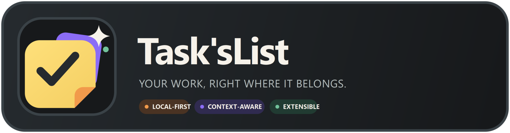
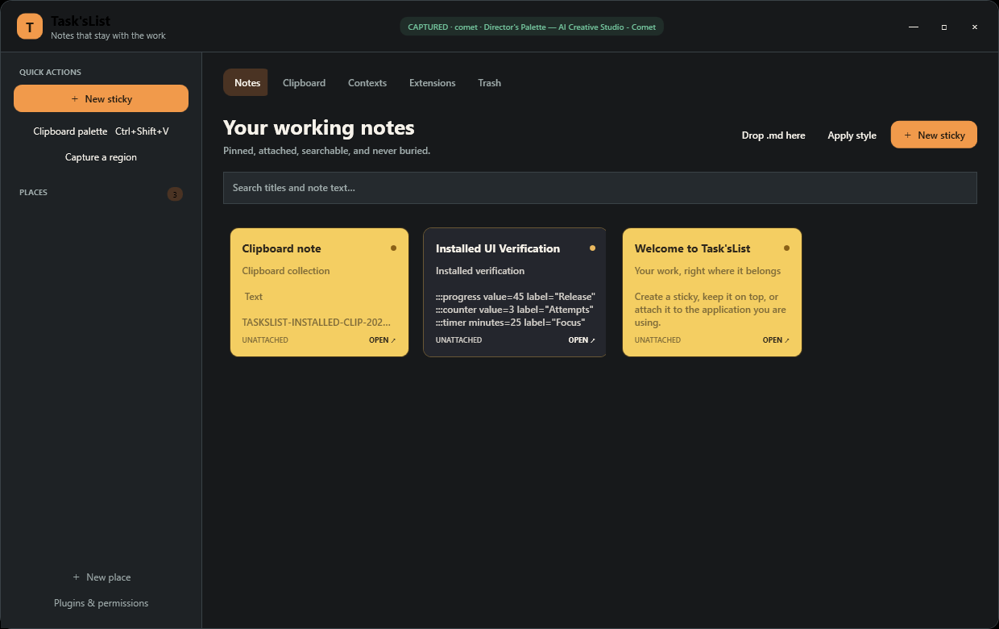
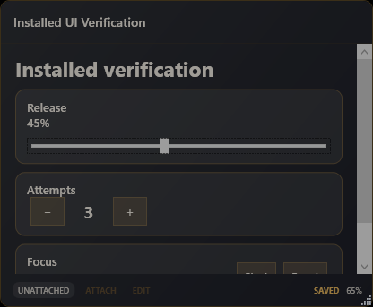
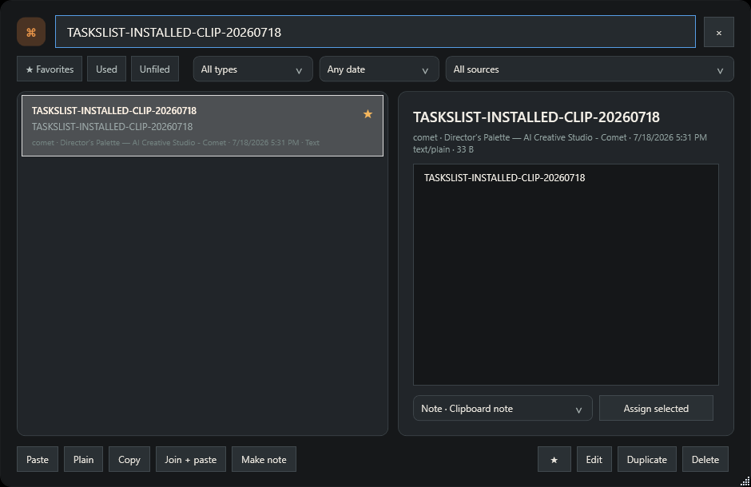

<p align="center">
  
</p>

<p align="center">
  <strong>Sticky notes that remember the work they belong to.</strong><br />
  Windows-native · Local-first · Infinite clipboard · App and browser context · Markdown · Plugins
</p>

Task'sList is a local-first Windows sticky-note and clipboard workspace. A note can stay on top, follow an application or browser tab, remember its presentation, and reappear precisely where it is useful. Clipboard history, capture, Places, browser tabs, and plugins support the note-first workflow without turning the application into another knowledge vault.

<p align="center">
  
</p>

## Why Task'sList

Most note applications remember text. Task'sList remembers **why the text exists**: the application, window, browser tab, clipboard source, place, visual state, and reminder associated with it.

| Surface | What makes it useful |
|---|---|
| **Desktop stickies** | Durable position, size, opacity, style, topmost state, snapping, rolling, locking, and edit/preview mode. |
| **Context attachment** | Notes can follow an application, a specific window, the browser, or an individual live tab. |
| **Clipboard memory** | Search an unlimited local history with provenance, favorites, filters, joined paste, and one-click note conversion. |
| **Portable interfaces** | Markdown remains readable everywhere while progress, counter, and timer directives become safe controls in Preview. |
| **Plugin ecosystem** | Permissioned out-of-process plugins add browser context, developer workflows, capture automation, and future integrations. |
| **Local trust boundary** | No account, telemetry service, or cloud dependency; page reading and AI access require explicit plugin capabilities. |

<p align="center">
  
  &nbsp;&nbsp;
  
</p>

## What is included

- Independent always-on-top stickies with durable position, size, pin, roll, lock, ghost, active/inactive opacity, and edit/preview mode.
- Eight paper presets plus custom colors, typography, density, toolbar behavior, corners, border, texture, shadow, and reusable named styles.
- Title dragging, F2 title editing, note-to-note/screen snapping, multi-monitor rescue, Ctrl+wheel opacity, reminders, sleep, and application attachment.
- A keyboard-first unlimited clipboard palette with search, provenance, favorites, source/type/date filters, original/plain paste, editing, multiselect, joined paste, assignments, and note conversion.
- Rich Markdown preview for headings, interactive tasks, tables, fenced code, and portable `progress`, `counter`, and `timer` blocks.
- Region capture, hierarchical Places, detected app/window contexts, and live Chromium tabs with private-window exclusion.
- A real-data library with Notes, Clipboard, Contexts, Extensions, and 30-day Trash views—no decorative application rows.
- A permissioned plugin SDK and three bundled examples: Browser Context, Developer Workspace, and Capture Workflows.

Everything is stored locally in `%LOCALAPPDATA%\TasksList`. There is no account requirement, telemetry service, or cloud dependency.

The visual identity masters, export process, color system, and usage rules are documented in [the Task'sList brand guide](docs/BRAND.md).

## Essential shortcuts

| Shortcut | Action |
|---|---|
| `Ctrl+Alt+N` | New sticky |
| `Ctrl+Alt+Shift+N` | New sticky from clipboard |
| `Ctrl+Shift+V` | Clipboard palette |
| `Ctrl+Shift+5` | Capture region |
| `Ctrl+Alt+S` | Show/hide all notes |
| `Ctrl+Alt+L` | Open the library |
| `Ctrl+Alt+Shift+G` | Disable click-through on every note |

Inside a sticky, use `F2` to edit the title, `Ctrl+M` to roll up, `Ctrl+L` to lock, `Ctrl+D` to duplicate, `Ctrl+Shift+T` to pin, and Ctrl+mouse-wheel to change opacity in 5% steps. Global shortcuts, snap tolerance, reduced motion, monitoring, and clipboard exclusions are configurable from the tray Settings command.

## Portable interactive Markdown

These directives remain readable in any text editor and become safe local controls in Preview mode:

```markdown
:::progress value=65 label="Release"
:::counter value=3 label="Attempts"
:::timer minutes=25 label="Focus"
```

Progress and counter changes write back to Markdown. Timer runtime state stays in SQLite; no block executes arbitrary code or gains network access.

## Browser companion

The native bridge is installed automatically. To enable live tabs, open `chrome://extensions` or `edge://extensions`, enable Developer mode, choose **Load unpacked**, and select `%LOCALAPPDATA%\Programs\TasksList\browser-extension`. The fixed extension ID is `fjgjagcnipdddcimgbohdpahbkakmnie`.

The extension receives tab identity only. It does not read page bodies, form values, passwords, cookies, history, or private windows. Page-reading or AI access requires a plugin that declares the capability and a user permission grant.

## Themes and plugins

The active utility-shell theme is `%LOCALAPPDATA%\TasksList\themes\active\theme.json`. Invalid edits fall back safely to the bundled theme. Per-note appearance is changed live from each sticky's Customize button and does not require restart.

Install `.taskplugin` packages from **Plugins & permissions**, or place an unpacked plugin containing `plugin.json` under `%LOCALAPPDATA%\TasksList\plugins`. Manifests declare a versioned API, entry point, and capabilities before the host exposes access.

## Build and install

Run:

```powershell
powershell -ExecutionPolicy Bypass -File scripts\build-release.ps1
powershell -ExecutionPolicy Bypass -File artifacts\release\install.ps1
```

The first command runs the Release test suite and creates a self-contained `win-x64` artifact in `artifacts\release`, including checksums, themes, browser companion, installer scripts, three installed plugins, and three `.taskplugin` packages.
