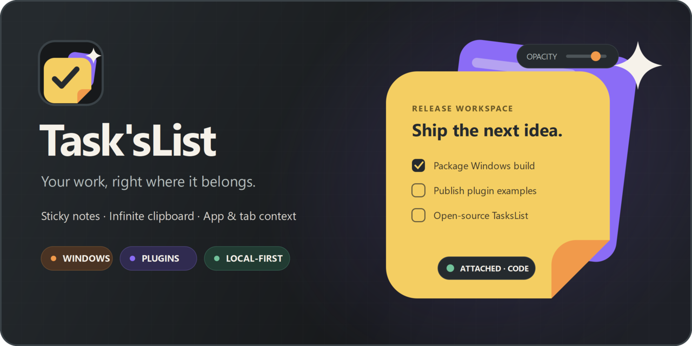

# Task'sList Brand Guide

Task'sList uses a layered context-card mark: a warm foreground sticky, a violet context card, a coral fold, and a small action spark. Together they represent notes, clipboard history, application attachment, plugins, and AI-assisted actions without making AI a requirement.


## Asset inventory

| Asset | Intended use |
|---|---|
| [`logo-mark.svg`](../assets/brand/logo-mark.svg) | Vector master for the application mark. |
| [`wordmark-horizontal.svg`](../assets/brand/wordmark-horizontal.svg) | Product name, tagline, and positioning badges. |
| [`github-social-preview.svg`](../assets/brand/github-social-preview.svg) | Editable 1280×640 repository and social card. |
| [`github-social-preview.png`](../assets/brand/generated/github-social-preview.png) | Raster social-preview upload. |
| [`TasksList.ico`](../assets/brand/generated/TasksList.ico) | Multi-frame Windows executable and notification-area icon. |
| `generated/app-icon-{size}.png` | Exact 16, 24, 32, 48, 64, 128, 256, and 512-pixel exports. |

The SVG masters are authoritative. Do not hand-edit the generated PNG or ICO files.

## Palette

| Name | Hex | Use |
|---|---:|---|
| Charcoal canvas | `#17191B` | App tile and dark background |
| Graphite panel | `#252A2E` | Elevated surfaces and dark ink |
| Paper amber | `#F4CE62` | Foreground sticky |
| Coral action | `#F19A4B` | Fold, CTA, and active state |
| Context violet | `#8B6CF6` | Rear card, contexts, and plugins |
| Mint status | `#72C29B` | Positive state and attachment cue |
| Warm cream | `#F6F2EA` | Wordmark and spark |

These colors complement the application theme tokens instead of replacing user-selectable note colors.

## Usage rules

- Keep clear space around the mark equal to at least half the front card's corner radius.
- Use the complete app tile at 16–64 pixels; do not add text inside small icons.
- Use the horizontal wordmark at widths of 320 pixels or greater.
- Preserve the relative positions and colors of the layered cards, fold, check, spark, and status dot.
- Do not rotate the complete mark, flatten it onto a low-contrast background, or recolor it with unrelated gradients.
- Product copy is `Task'sList`; the punctuation-free repository and filesystem identifier is `TasksList`.

## Regenerating exports

ImageMagick 7 is required. From the repository root, run:

```powershell
powershell -ExecutionPolicy Bypass -File scripts\export-brand-assets.ps1
```

The exporter renders every required size from the vector masters, creates the multi-frame ICO, validates that each output is non-empty, and writes only beneath `assets\brand\generated`.

Automated brand checks additionally verify SVG accessibility metadata, PNG dimensions, and ICO frame sizes:

```powershell
.\.tools\dotnet\dotnet.exe test tests\TasksList.App.Tests\TasksList.App.Tests.csproj -c Release --filter FullyQualifiedName~BrandAssetTests
```

## GitHub social preview

Upload [`assets/brand/generated/github-social-preview.png`](../assets/brand/generated/github-social-preview.png) in the repository's social preview settings. It is 1280×640 pixels and keeps all important text and artwork within a generous safe area.


